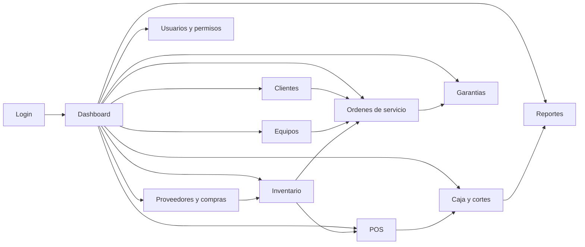

# Flujo de pantallas

```mermaid
flowchart LR
  A["Login"] --> B["Dashboard"]
  B --> C["Clientes"]
  B --> D["Equipos"]
  B --> E["Ordenes de servicio"]
  B --> F["Inventario"]
  B --> G["POS"]
  B --> H["Caja y cortes"]
  B --> I["Reportes"]
  B --> J["Proveedores y compras"]
  B --> K["Garantias"]
  B --> L["Usuarios y permisos"]
  C --> E
  D --> E
  E --> K
  F --> E
  F --> G
  J --> F
  G --> H
  H --> I
```
